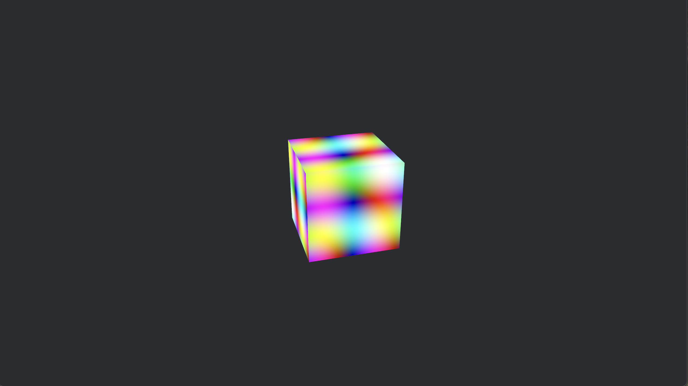

# Using Bevy with Winit

---
**Goals**:
- spawn a winit window
- draw a cube in the center
- render an image on each surface of the cube
- use mouse to orbit/pan/zoom
---

Bevy is a game engine. We will be using bevy to draw things on our winit window since WGPU is too low level for our liking.

Bevy is huge and complicated. We won't really be focusing on concepts like ECS here. We are focused on rendering something to the screen here.

## First Bevy App

Simplest way to spawn a window with Bevy:

```rust
use bevy::prelude::*;

fn main() {
    App::new().add_plugins(DefaultPlugins).run();
}
```

This spawns an empty window for us because:

1. `DefaultPlugins` includes the `WindowPlugin`.
2. `WindowPlugin` uses the `winit` crate behind the scenes.


## Spawning our own Window
We can also customize our window using something like:

```rust
use bevy::{prelude::*, window::PrimaryWindow};

struct MyWindowPlugin;

impl Plugin for MyWindowPlugin {
    fn build(&self, app: &mut App) {
        app.add_systems(Startup, create_window);
    }
}

fn create_window(mut commands: Commands) {
    commands.spawn((
        Window {
            title: "Bevy Window".to_string(),
            resolution: (1280, 720).into(),
            resizable: true,
            ..default()
        },
        PrimaryWindow,
    )); // create our own window and mark it as primary
}

fn main() {
    App::new()
        .add_plugins(DefaultPlugins.set(WindowPlugin {
            primary_window: None, // no window, we will create our own
            ..default()
        }))
        .add_plugins(MyWindowPlugin)
        .run();
}
```

This creates and registers a `Window` component to our app. Internally, the `WindowPlugin` plugin does something similar as well.

We can go even lower by creating a window using `winit` directly and rendering Bevy into that window but let's save that for later. Now that we have a window, we can drawing things inside it.


## Rendering a Cube

To render and "see" a cube, we need 3 things:
1. The cube (duh!)
2. A light source that "illuminates" the cube.
3. A camera that defines how the 3D scene is projected onto a 2d screen 

### Sike! There is No Cube

An important concept here is that there is no cube "object". Instead, the cube "entity" has three "components" (ECS baby)
1. Mesh (shape/wireframe)
2. Material (look/feel/interaction)
3. Transform (size/position/rotation of the mesh)

Remember: It's just triangles all the way!

```rust
use bevy::prelude::*;

fn main() {
    App::new()
        .add_plugins(DefaultPlugins)
        .add_systems(Startup, setup)
        .run();
}

/// set up a simple 3D scene
fn setup(
    mut commands: Commands,
    mut meshes: ResMut<Assets<Mesh>>,
    mut materials: ResMut<Assets<StandardMaterial>>,
) {
    // cube
    commands.spawn((
        Mesh3d(meshes.add(Cuboid::new(1.0, 1.0, 1.0))),
        MeshMaterial3d(materials.add(Color::srgb_u8(124, 144, 255))),
        Transform::from_xyz(0.0, 0.5, 0.0),
    ));

    // light
    commands.spawn((
        PointLight {
            shadow_maps_enabled: true,
            ..default()
        },
        Transform::from_xyz(4.0, 8.0, 4.0),
    ));

    // camera
    commands.spawn((
        Camera3d::default(),
        Transform::from_xyz(-2.5, 4.5, 9.0).looking_at(Vec3::ZERO, Vec3::Y),
    ));
}
```

## Shaders

We can define "custom" materials using shaders.

A shader is a function that runs on a GPU. We define a custom shader using `wgsl` (WebGPU shading language). First we define the Rust side of things.

```rust
use bevy::{prelude::*, render::render_resource::AsBindGroup, shader::ShaderRef};

#[derive(Asset, TypePath, AsBindGroup, Debug, Clone)]
pub struct MyMaterial {
    #[uniform(0)]
    pub frequency: f32,
}

impl MyMaterial {
    fn new(freq: f32) -> Self {
        Self { frequency: freq }
    }
}

impl Material for MyMaterial {
    fn fragment_shader() -> ShaderRef {
        "shaders/proc_material.wgsl".into()
    }
}

fn main() {
    App::new()
        .add_plugins(DefaultPlugins)
        .add_plugins(MaterialPlugin::<MyMaterial>::default())
        .add_systems(Startup, setup)
        .run();
}

fn setup(
    mut commands: Commands,
    mut meshes: ResMut<Assets<Mesh>>,
    mut materials: ResMut<Assets<MyMaterial>>,
) {
    commands.spawn((
        Mesh3d(meshes.add(Cuboid::new(2.0, 2.0, 2.0))),
        MeshMaterial3d(materials.add(MyMaterial::new(10.0))),
    ));

    // light
    commands.spawn((
        PointLight {
            shadows_enabled: true,
            ..default()
        },
        Transform::from_xyz(4.0, 8.0, 4.0),
    ));
    // camera
    commands.spawn((
        Camera3d::default(),
        Transform::from_xyz(-2.5, 4.5, 9.0).looking_at(Vec3::ZERO, Vec3::Y),
    ));
}
```

We spawn the same components, but instead of using a `StandardMaterial`, we spawn our own `MyMaterial`. This material needs a shader to tell the GPU what to render on the surface of our cube. We define this in a `wgsl` file. The `AsBindGroup` trait tells Bevy that we want to use this struct in a shader. 

You can think of a `uniform` as a `const` in a particular GPU "slot". This bind data is "packed" in a layout and passed to our shader. We will define an equivalent struct inside the shader as well to interpret this data in our shader.


```wgsl
#import bevy_pbr::forward_io::VertexOutput

struct MyMaterial {
    frequency: f32,
};

@group(#{MATERIAL_BIND_GROUP}) @binding(0)
var<uniform> material: MyMaterial;

@fragment
fn fragment(
    mesh: VertexOutput,
) -> @location(0) vec4<f32> {
    let center = vec2<f32>(0.0, 0.0);

    let uv = mesh.uv;

    let d = distance(uv, center);

    let r = 0.5 + 0.5 * sin(uv.x * material.frequency);
    let g = 0.5 - 0.5 * sin(uv.y * material.frequency);
    let b = 0.5 + 0.5 * sin(d * material.frequency);

    return vec4<f32>(r, g, b, 1.0);
}
```

This shader uses sine waves to determine RGB values for each pixel in the fragment. This makes our cube look much more interesting. Still ugly, but interesting.



# Animation

We can go even further and parameterize the material with time. We'll do this by adding another system to our app. This system executes on every update.

```rust
use bevy::{prelude::*, render::render_resource::AsBindGroup, shader::ShaderRef};

#[derive(Asset, TypePath, AsBindGroup, Debug, Clone)]
pub struct MyMaterial {
    #[uniform(0)]
    pub frequency: f32,
    #[uniform(0)]
    pub time: f32,
}

impl MyMaterial {
    fn new(freq: f32) -> Self {
        Self {
            frequency: freq,
            time: 0.0,
        }
    }

    fn update_time(&mut self, time: f32) {
        self.time = time;
    }
}

impl Material for MyMaterial {
    fn fragment_shader() -> ShaderRef {
        "shaders/proc_material.wgsl".into()
    }
}

fn main() {
    App::new()
        .add_plugins(DefaultPlugins)
        .add_plugins(MaterialPlugin::<MyMaterial>::default())
        .add_systems(Startup, setup)
        .add_systems(Update, animate)
        .run();
}

fn setup(
    mut commands: Commands,
    mut meshes: ResMut<Assets<Mesh>>,
    mut materials: ResMut<Assets<MyMaterial>>,
) {
    commands.spawn((
        Mesh3d(meshes.add(Cuboid::new(2.0, 2.0, 2.0))),
        MeshMaterial3d(materials.add(MyMaterial::new(10.0))),
    ));

    // light
    commands.spawn((
        PointLight {
            shadows_enabled: true,
            ..default()
        },
        Transform::from_xyz(4.0, 8.0, 4.0),
    ));
    // camera
    commands.spawn((
        Camera3d::default(),
        Transform::from_xyz(-2.5, 4.5, 9.0).looking_at(Vec3::ZERO, Vec3::Y),
    ));
}

fn animate(
    material_handles: Query<&MeshMaterial3d<MyMaterial>>,
    time: Res<Time>,
    mut materials: ResMut<Assets<MyMaterial>>,
) {
    for material_handle in material_handles.iter() {
        if let Some(material) = materials.get_mut(material_handle) {
            material.update_time(time.elapsed_secs())
        }
    }
}
```

And the shader:

```wgsl
#import bevy_pbr::forward_io::VertexOutput

struct MyMaterial {
    frequency: f32,
    time: f32,
};

@group(#{MATERIAL_BIND_GROUP}) @binding(0)
var<uniform> material: MyMaterial;

@fragment
fn fragment(
    mesh: VertexOutput,
) -> @location(0) vec4<f32> {
    let center = vec2<f32>(0.0, 0.0);

    let uv = mesh.uv;

    let d = distance(uv, center);

    let r = 0.5 + 0.5 * sin(uv.x * material.frequency + material.time);
    let g = 0.5 + 0.5 * cos(uv.y * material.frequency + material.time);
    let b = 0.5 + 0.5 * tanh(d * material.frequency + material.time);

    return vec4<f32>(r, g, b, 1.0);
}
```

This makes our cube even more interesting.

<video width="320" height="240" controls>
  <source src="./media/bevy-animated-cube.mov" type="video/mp4">
</video>


## Rendering the Image

Coming to what was promised to us. With Bevy it's actually really simple (also opaque and magical) to render an image on each face of our cube.


```rust
use bevy::{prelude::*, render::render_resource::AsBindGroup};
use bevy_panorbit_camera::{PanOrbitCamera, PanOrbitCameraPlugin};

#[derive(Asset, TypePath, AsBindGroup, Debug, Clone)]
pub struct MyMaterial {
    #[uniform(0)]
    pub frequency: f32,
    #[uniform(0)]
    pub time: f32,
}

fn main() {
    App::new()
        .add_plugins(DefaultPlugins)
        .add_plugins(PanOrbitCameraPlugin)
        .add_systems(Startup, setup)
        .run();
}

fn setup(
    mut commands: Commands,
    assets: Res<AssetServer>,
    mut meshes: ResMut<Assets<Mesh>>,
    mut materials: ResMut<Assets<StandardMaterial>>,
) {
    let texture_handle = assets.load("textures/image.png");

    commands.spawn((
        Mesh3d(meshes.add(Cuboid::new(2.0, 2.0, 2.0))),
        MeshMaterial3d(materials.add(StandardMaterial {
            base_color_texture: Some(texture_handle),
            ..default()
        })),
    ));

    // light
    commands.spawn((
        PointLight {
            shadows_enabled: true,
            ..default()
        },
        Transform::from_xyz(4.0, 8.0, 4.0),
    ));
    // camera
    commands.spawn((
        PanOrbitCamera::default(),
        Transform::from_xyz(-2.5, 4.5, 9.0).looking_at(Vec3::ZERO, Vec3::Y),
    ));
}
```

Also added a bonus pan-orbit-zoom using an external plugin :) Looks kinda nice now hehe

<video width="320" height="240" controls>
  <source src="./media/bevy-image-cube.mov" type="video/mp4">
</video>

Note that some faces of the cube are darker than others as we are moving the camera instead of the light source. The light remains stationary. So the light only illuminates some faces of the cube.  