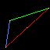
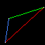
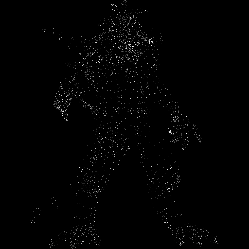
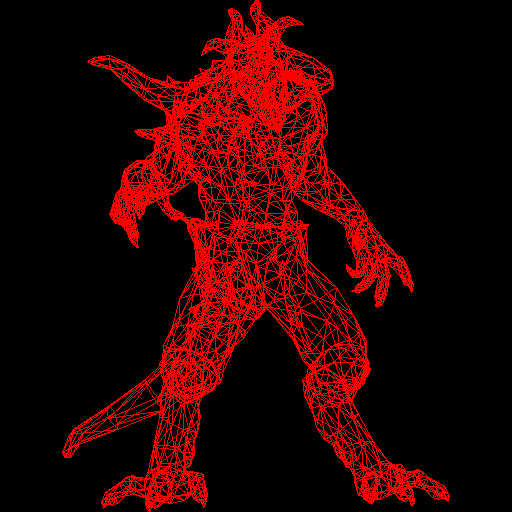

# What is Rendering

---
**Goals:**
- Understand how rendering works
- Understand algorithms behind wgpu and GPU rendering
- implement own tiny rendering engine
---

For this part, we will be following https://haqr.eu/tinyrenderer/ but in Rust!

## Step 0: Setup

We setup some dependencies and draw some points in our output. For images we'll be using the `image` crate to simplify things.

```rust
use image::{Rgb, RgbImage, imageops::flip_vertical_in_place};

const WHITE: Rgb<u8> = Rgb([255, 255, 255]);
const RED: Rgb<u8> = Rgb([255, 0, 0]);
const GREEN: Rgb<u8> = Rgb([0, 255, 0]);
const BLUE: Rgb<u8> = Rgb([64, 128, 255]);
const YELLOW: Rgb<u8> = Rgb([255, 200, 0]);

type Point = (u32, u32);

fn main() -> anyhow::Result<()> {
    let width = 64;
    let height = 64;

    let mut img = RgbImage::new(width, height);

    let a = (7, 3);
    let b = (12, 37);
    let c = (62, 53);

    img[a] = WHITE;
    img[b] = WHITE;
    img[c] = WHITE;

    // because the tutorial uses a different coordinate system than ours
    flip_vertical_in_place(&mut img);
    img.save("out.png")?;

    Ok(())
}

```

This should produce something like (scaled up): 


## Step 1: Wireframes

To draw a wireframe we need to be able to draw lines. Therefore:
### What is a Line

We will be using [Bresenham's Line Drawing Algorithm](https://en.wikipedia.org/wiki/Bresenham%27s_line_algorithm)

First approach: sample N points between two points A and B. Draw each sampled point. 
How to sample points? 

```
for t: [0, 1]

x(t) = a_x + t * (b_x - a_x) 
y(t) = a_y + t * (b_y - a_y)
```

This is very similar to the traditional definition of a line segment. 

```rust
fn point(img: &mut RgbImage, p: Point, color: Rgb<u8>) {
    img[p] = color;
}

fn line1(img: &mut RgbImage, a: Point, b: Point, color: Rgb<u8>) {
    let step = 0.02;
    let n_points = (1.0f32 / step).floor() as u32;

    (0..n_points).for_each(|i| {
        let t = step * i as f32;
        let x = (a.0 as f32 + (t * (b.0 as f32 - a.0 as f32)).round()) as u32;
        let y = (a.1 as f32 + (t * (b.1 as f32 - a.1 as f32)).round()) as u32;

        let point = (x, y);

        img[point] = color;
    });
}

fn main() -> anyhow::Result<()> {
    let width = 64;
    let height = 64;

    let mut img = RgbImage::new(width, height);

    let a = (7, 3);
    let b = (12, 37);
    let c = (62, 53);

    line1(&mut img, a, b, BLUE);
    line1(&mut img, c, b, GREEN);
    line1(&mut img, c, a, YELLOW);
    line1(&mut img, a, c, RED);

    point(&mut img, a, WHITE);
    point(&mut img, b, WHITE);
    point(&mut img, c, WHITE);

    // because the tutorial uses a different coordinate system than ours
    flip_vertical_in_place(&mut img);
    img.save("out.png")?;

    Ok(())
}
```



Why do we have gaps in the red line? We sample `t` an arbitrary `1/0.02 = 50` times. Whereas, there are `63-7=55` pixels between points A and C. 

Instead of defining X(t) we can define t(X) (or t(Y) if the line is steeper than it is wider!).

```rust
fn line2(img: &mut RgbImage, mut a: Point, mut b: Point, color: Rgb<u8>) {
    let is_steeper = a.0.abs_diff(b.0) < a.1.abs_diff(b.1);

    if is_steeper {
        // transpose
        a = (a.1, a.0);
        b = (b.1, b.0);
    }

    if a.0 > b.0 {
        swap(&mut a, &mut b);
    }

    for x in a.0..=b.0 {
        let t: f32 = (x - a.0) as f32 / (b.0 - a.0) as f32;
        let y = a.1 + (t * (b.1 - a.1) as f32).round() as u32;

        if is_steeper {
            // de-transpose
            img[(y, x)] = color;
        } else {
            img[(x, y)] = color;
        }
    }
}
```

This gives us lines without any gaps :) 




### Optimizing our Line Drawing Function

Before making any optimizations, let's measure some timings first. 

```rust
fn main() -> anyhow::Result<()> {
    let width = 64;
    let height = 64;

    let mut img = RgbImage::new(width, height);

    for i in 0..(1 << 24) {
        let a = (rand::random_range(0..width), rand::random_range(0..height));
        let b = (rand::random_range(0..width), rand::random_range(0..height));

        let color: Rgb<u8> = Rgb(rand::random());

        line2(&mut img, a, b, color);
    }

    // because the tutorial uses a different coordinate system than ours
    flip_vertical_in_place(&mut img);
    img.save("out.png")?;

    Ok(())
}
```

```bash
$ hyperfine ../../target/release/tinyrenderer --warmup 3
Benchmark 1: ../../target/release/tinyrenderer
  Time (mean ± σ):      1.562 s ±  0.005 s    [User: 1.543 s, System: 0.015 s]
  Range (min … max):    1.554 s …  1.570 s    10 runs

```

After some optimizations:

```rust
fn line3(img: &mut RgbImage, mut a: Point, mut b: Point, color: Rgb<u8>) {
    let is_steeper = a.0.abs_diff(b.0) < a.1.abs_diff(b.1);

    if is_steeper {
        // transpose
        a = (a.1, a.0);
        b = (b.1, b.0);
    }

    if a.0 > b.0 {
        swap(&mut a, &mut b);
    }

    let delta_x = (b.0 - a.0) as f32;
    let delta_y = (b.1 as i32 - a.1 as i32) as f32;
    let slope = delta_y / delta_x;

    let mut fy = a.1 as f32;

    for x in a.0..=b.0 {
        let y = fy.round() as u32;

        if is_steeper {
            // de-transpose
            img[(y, x)] = color;
        } else {
            img[(x, y)] = color;
        }

        fy += slope;
    }
}
```

```bash
$ hyperfine ../../target/release/tinyrenderer --warmup 3
Benchmark 1: ../../target/release/tinyrenderer
  Time (mean ± σ):      1.182 s ±  0.003 s    [User: 1.167 s, System: 0.013 s]
  Range (min … max):    1.177 s …  1.185 s    10 runs
```

After more optimizations (eliminate floating point calculations). This is the original Bresenhaum's algorithm.

```rust
fn line4(img: &mut RgbImage, mut a: Point, mut b: Point, color: Rgb<u8>) {
    let is_steeper = a.0.abs_diff(b.0) < a.1.abs_diff(b.1);

    if is_steeper {
        // transpose
        a = (a.1, a.0);
        b = (b.1, b.0);
    }

    // always move left to right
    if a.0 > b.0 {
        swap(&mut a, &mut b);
    }

    let dx = (b.0 - a.0) as i32;
    let dy = b.1.abs_diff(a.1) as i32;

    let mut err: i32 = 0;

    let mut y = a.1 as i32;

    let y_step: i32 = if a.1 < b.1 { 1 } else { -1 };

    for x in a.0..=b.0 {
        if is_steeper {
            img[(y as u32, x)] = color;
        } else {
            img[(x, y as u32)] = color;
        }

        err += dy;

        if 2 * err >= dx {
            y += y_step;
            err -= dx;
        }
    }
}
```

```bash
$ hyperfine ../../target/release/tinyrenderer --warmup 3
Benchmark 1: ../../target/release/tinyrenderer
  Time (mean ± σ):      1.509 s ±  0.005 s    [User: 1.487 s, System: 0.017 s]
  Range (min … max):    1.502 s …  1.516 s    10 runs
```

It runs slower :|||| This is because on modern hardware:
- floating point operations are not much slower than integer operations
- LLVM is able to autovectorize FP ops.
- unpredictable branches hamper pipelining of CPU instructions.

### Drawing a Wireframe

Exciting stuff. We will be loading and parsing a Wavefront Object file and drawing it. 

Let's get the boring stuff out of the way. Reading and parsing the file. 

```rust
// wavefront.rs
use std::{fs::File, io::Read, path::Path};

use anyhow::Context;

pub type Vertex3 = (f32, f32, f32);
pub type Triangle = (usize, usize, usize);

pub struct Wavefront {
    vertices: Vec<Vertex3>,
    triangles: Vec<Triangle>,
}

impl Wavefront {
    fn new(vertices: Vec<Vertex3>, triangles: Vec<Triangle>) -> Self {
        Self {
            vertices,
            triangles,
        }
    }

    pub fn read_from_file(p: &Path) -> anyhow::Result<Self> {
        let mut file = File::open(p)?;
        let mut buf = String::new();

        file.read_to_string(&mut buf)?;

        let mut vertices = vec![];
        let mut triangles = vec![];

        for line in buf.lines() {
            if line.starts_with("v ") {
                let v = parse_vertex_line(line)?;

                vertices.push(v);
            }

            if line.starts_with("f ") {
                let t = parse_face_line(line)?;

                triangles.push(t);
            }
        }

        Ok(Self {
            vertices,
            triangles,
        })
    }

    pub fn vertices(&self) -> &[(f32, f32, f32)] {
        &self.vertices
    }

    pub fn triangles(&self) -> &[(usize, usize, usize)] {
        &self.triangles
    }
}

fn parse_vertex_line(l: &str) -> anyhow::Result<Vertex3> {
    let mut iter = l.split(" ");

    iter.next();

    let x = iter.next().context("expected x coord")?.parse::<f32>()?;

    let y = iter.next().context("expected y coord")?.parse::<f32>()?;

    let z = iter.next().context("expected z coord")?.parse::<f32>()?;

    Ok((x, y, z))
}

fn parse_face_line(l: &str) -> anyhow::Result<Triangle> {
    let mut iter = l.split(" ");

    iter.next();

    let a = iter
        .next()
        .context("expected vertex")?
        .split("/")
        .next()
        .context("expected index")?
        .parse::<usize>()?;

    let b = iter
        .next()
        .context("expected vertex")?
        .split("/")
        .next()
        .context("expected index")?
        .parse::<usize>()?;

    let c = iter
        .next()
        .context("expected vertex")?
        .split("/")
        .next()
        .context("expected index")?
        .parse::<usize>()?;

    Ok((a, b, c))
}
```

Now that we have a `Wavefront` object, we can use it to draw the only two things we can draw: points and lines.

But the vertices in this object are 3d coordinates and we only know how to draw in 2d space. Moreover, the coordinates are scaled down to `[-1, 1]`. We fix this by projecting+transforming+scaling these coordinates. 

```rust
fn project_transform_scale(v: &Vertex3) -> Point {
    // orthogonal projection
    // front view (looking down z-axis)
    let p = (v.0, v.1);

    // [-1, 1] -> [0, 2]
    let p = (p.0 + 1.0, p.1 + 1.0);

    // [0, 2] -> [0, W], [0, 2] -> [0, H]
    let p = (
        p.0 * (WIDTH - 1) as f32 / 2.0,
        p.1 * (HEIGHT - 1) as f32 / 2.0,
    );

    (p.0.round() as u32, p.1.round() as u32)
}
```

Let's just draw all vertices first to see how it turns out. 

```rust
fn draw_wavefront(img: &mut RgbImage, wavefront: &Wavefront) {
    for vertex in wavefront.vertices() {
        let p = project_transform_scale(vertex);

        point(img, p, WHITE);
    }
}

fn main() -> anyhow::Result<()> {
    let path: PathBuf = std::env::args()
        .nth(1)
        .ok_or_else(|| anyhow::anyhow!("Usage: tinyrenderer <path_to_obj_file>"))?
        .into();

    let wavefront = Wavefront::read_from_file(&path)?;

    let mut img = RgbImage::new(WIDTH, HEIGHT);

    draw_wavefront(&mut img, &wavefront);

    // because the tutorial uses a different coordinate system than ours
    flip_vertical_in_place(&mut img);
    img.save("out.png")?;

    Ok(())
}
```


This gives us something like:


We can already start seeing the shape :)

Drawing lines is very easy now. 

```rust
fn draw_wavefront(img: &mut RgbImage, wavefront: &Wavefront) {
    for vertex in wavefront.vertices() {
        let p = project_transform_scale(vertex);

        point(img, p, WHITE);
    }

    let vertices = wavefront.vertices();

    for triangle in wavefront.triangles() {
        let a = project_transform_scale(&vertices[triangle.0 - 1]);
        let b = project_transform_scale(&vertices[triangle.1 - 1]);
        let c = project_transform_scale(&vertices[triangle.2 - 1]);

        line(img, a, b, RED);
        line(img, b, c, RED);
        line(img, c, a, RED);
    }
}
```

Which gives us this beauty.

