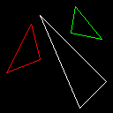
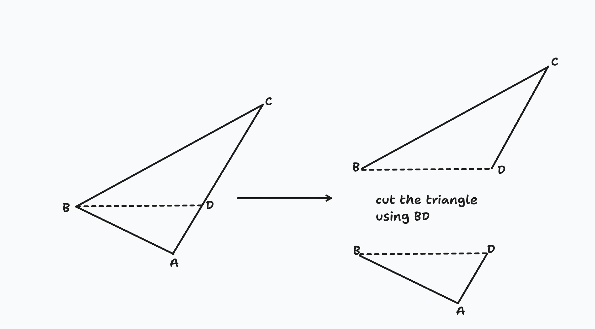
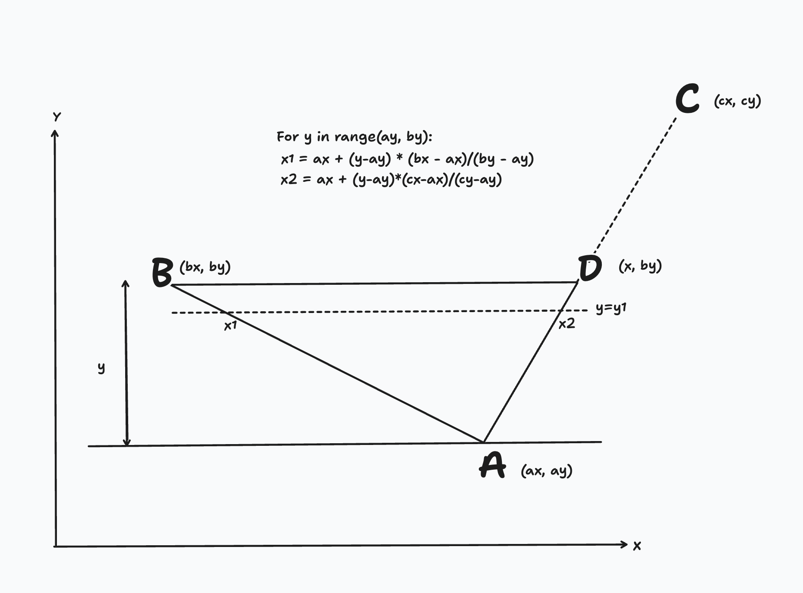
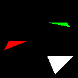
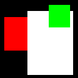
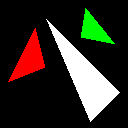
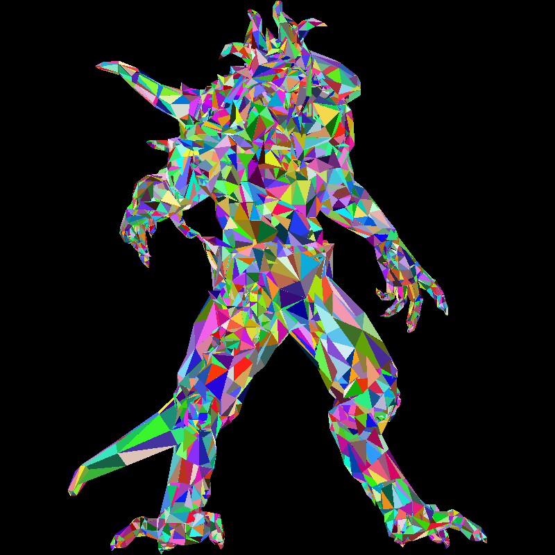
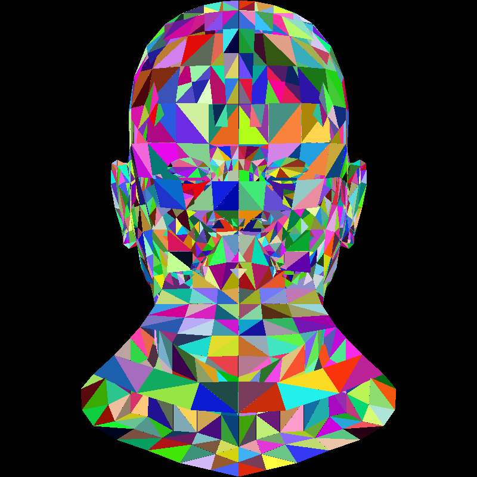
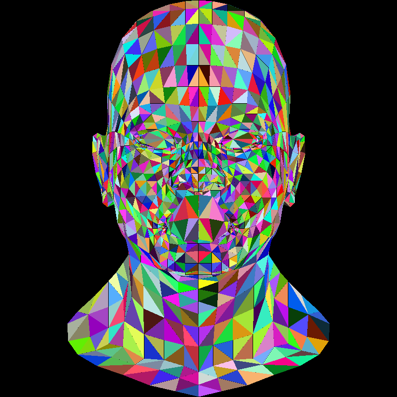

# Getting started with winit

---
**Goals**:
 - continue with tinyrenderer
 - learn about rasterization
 - draw triangles
 - learn about barycentric coordinates
---

## Drawing a Triangle

Continuing from last time. We can draw a triangle using three lines. 

```rust
fn triangle(img: &mut RgbImage, a: Point, b: Point, c: Point, color: Rgb<u8>) {
    line(img, a, b, color);
    line(img, b, c, color);
    line(img, c, a, color);
}

fn main() -> anyhow::Result<()> {
    let mut img = RgbImage::new(WIDTH, HEIGHT);

    triangle(&mut img, (7, 45), (35, 100), (45, 60), RED);
    triangle(&mut img, (120, 35), (90, 5), (45, 110), WHITE);
    triangle(&mut img, (115, 83), (80, 90), (85, 120), GREEN);

    // because the tutorial uses a different coordinate system than ours
    flip_vertical_in_place(&mut img);
    img.save("out.png")?;

    Ok(())
}

```



## Approach 1: Scanline Rendering

We can draw the edges of our triangle but how do we fill our triangles? We will be using the [scanline rendering](https://en.wikipedia.org/wiki/Scanline_rendering) algorithm for this. 

This took me a while to understand. But here it is:

1. Sort vertices of the triangle by their y-coordinates. 
```rust
let sort_by_y = |vertices: (Point, Point, Point)| -> (Point, Point, Point) {
	let mut v = [vertices.0, vertices.1, vertices.2];
	v.sort_by_cached_key(|v| v.1);

	(v[0], v[1], v[2])
};
    
let (a, b, c) = sort_by_y((a, b, c));
```

2. We will cut the triangle into 2 parts. 


We will fill both parts separately. Let's start with the lower part. We want to draw horizontal lines parallel to BD and find their intersection with lines AB and AD.

(NOTE: the origin (0, 0) is in the bottom left here for simplicity. in the tutorial and other graphics libraries, the origin is usually on the top-left corner.)
3. We can find the line segments (X1X2) using the formula for a line passing through 2 points. 
For each line belonging to our triangle we find it's endpoints and then fill each point in that line. 

This gives us:
```rust
let ax = a.0 as i32;
let ay = a.1 as i32;

let bx = b.0 as i32;
let by = b.1 as i32;

let cx = c.0 as i32;
let cy = c.1 as i32;

for y in ay..=by {
	let x1 = ax + (y - ay) * (bx - ax) / (by - ay);
	let x2 = ax + (y - ay) * (cx - ax) / (cy - ay);

	for x in x1.min(x2)..x1.max(x2) {
		img[(x as u32, y as u32)] = color;
	}
}
```



Drawing the upper half of our triangles similarly:

```rust
for y in by..=cy {
	let x1 = bx + (y - by) * (cx - bx) / (cy - by);
	let x2 = ax + (y - ay) * (cx - ax) / (cy - ay);

	for x in x1.min(x2)..x1.max(x2) {
		img[(x as u32, y as u32)] = color;
	}
}
```

We have our fully filled triangles!


For completeness, this is our triangle function (in more idiomatic Rust):

```rust
fn triangle(img: &mut RgbImage, a: Point, b: Point, c: Point, color: Rgb<u8>) {  
	// sort vertices by y  
	let mut v = [a, b, c];  
	v.sort_by_key(|&(_, y)| y);  
	  
	let [(ax, ay), (bx, by), (cx, cy)] = v.map(|(x, y)| (x as i32, y as i32));  
	  
	// helper for drawing horizontal spans  
	let mut draw_span = |y: i32, x1: i32, x2: i32| {  
	let (l, r) = if x1 <= x2 { (x1, x2) } else { (x2, x1) };  
	for x in l..r {  
	img[(x as u32, y as u32)] = color;  
	}  
	};  
	  
	let interp = |y, (x0, y0), (x1, y1)| {  
	x0 + (y - y0) * (x1 - x0) / (y1 - y0)  
	};  
	  
	// upper half  
	for y in ay..=by {  
	let x1 = interp(y, (ax, ay), (bx, by));  
	let x2 = interp(y, (ax, ay), (cx, cy));  
	draw_span(y, x1, x2);  
	}  
	  
	// lower half  
	for y in by..=cy {  
	let x1 = interp(y, (bx, by), (cx, cy));  
	let x2 = interp(y, (ax, ay), (cx, cy));  
	draw_span(y, x1, x2);  
	}  
}
```

## Approach 2: Bounding Box Rasterization

While our algorithm works, it is slow and designed for single threaded CPUs. 
We can improve performance significantly using the following algorithm:

```
triangle(a, b, c) {
	bbmin, bbmax = find_bbox(a, b, c);
	
	for px in (bbmin, bbmax) {
		if px in triangle {
			color(px)
		}
	}
}
```

Finding and drawing bounding boxes is easy:
```rust
fn find_bbox(a: Point, b: Point, c: Point) -> (Point, Point) {
    let xmin = *[a.0, b.0, c.0].iter().min().unwrap();
    let ymin = *[a.1, b.1, c.1].iter().min().unwrap();

    let xmax = *[a.0, b.0, c.0].iter().max().unwrap();
    let ymax = *[a.1, b.1, c.1].iter().max().unwrap();

    ((xmin, ymin), (xmax, ymax))
}

fn draw_bbox(img: &mut RgbImage, bbmin: Point, bbmax: Point, color: Rgb<u8>) {
    for x in bbmin.0..bbmax.0 {
        for y in bbmin.1..bbmax.1 {
            img[(x, y)] = color;
        }
    }
}
```



Now we need to find a way to eliminate pixels that do not belong to the triangle. For this we will use the [Barycentric Coordinates](https://en.wikipedia.org/wiki/Barycentric_coordinate_system) system. 

Here is me struggling to understand Barycentric Coordinates with ChatGPT: https://chatgpt.com/share/69a3ff40-9c74-8007-851e-2676009e1587

Converting all of this to code:

```rust
fn triangle2(img: &mut RgbImage, a: Point, b: Point, c: Point, color: Rgb<u8>) {
    let (bbmin, bbmax) = find_bbox(a, b, c);

    let area_abc = signed_area(a, b, c);

    for x in bbmin.0..bbmax.0 {
        for y in bbmin.1..bbmax.1 {
            let p = (x, y);

            let alpha = signed_area(p, b, c) / area_abc;
            let beta = signed_area(a, p, c) / area_abc;
            let gamma = signed_area(a, b, p) / area_abc;

            if alpha > 0.0 && gamma > 0.0 && beta > 0.0 {
                img[(x, y)] = color;
            }
        }
    }
}
```

We get beautiful triangles like these:




#### Drawing a Wavefront (again)

Now that we can draw filled triangles, we can do better with our wavefront object. Rewriting our `draw_wavefront` code to use triangles,

```rust
fn draw_wavefront(img: &mut RgbImage, wavefront: &Wavefront) {
    let vertices = wavefront.vertices();

    for ft in wavefront.triangles() {
        let a = project_transform_scale(&vertices[ft.0 - 1]);
        let b = project_transform_scale(&vertices[ft.1 - 1]);
        let c = project_transform_scale(&vertices[ft.2 - 1]);

        let color: Rgb<u8> = Rgb(rand::random());

        triangle(img, a, b, c, color);
    }
}

fn main() -> anyhow::Result<()> {
    let path: PathBuf = std::env::args()
        .nth(1)
        .ok_or_else(|| anyhow::anyhow!("Usage: tinyrenderer <path_to_obj_file>"))?
        .into();

    let wavefront = Wavefront::read_from_file(&path)?;

    let mut img = RgbImage::new(WIDTH, HEIGHT);

    draw_wavefront(&mut img, &wavefront);

    // because the tutorial uses a different coordinate system than ours
    flip_vertical_in_place(&mut img);
    img.save("out.png")?;

    Ok(())
}
```

We get this:



Crazy! Let's try another model:



The problem is that we are drawing ALL faces. Including the ones that should be hidden. For now, we can add a simple check:
```
let area_abc = signed_area(a, b, c);

if area_abc < 1.0 {
	return;
}

```




Which gives us a slightly better render. Still not good enough since we are not drawing in order. Faces that should be in front (closer to us on the z-axis) are being overlapped by faces that should be behind. We will fix this in a later section. For now, we have another problem to solve. 

We can see that our nested for loop is an [embarrassingly parallel](https://en.wikipedia.org/wiki/Embarrassingly_parallel) problem. But Rust does not allow us to share a mutable reference to the `img` object between threads. For this, we can get mutable handle to the underlying pixel buffer and promise the compiler to only operate on non-overlapping chunks (in our case, rows of the buffer). 

```rust
use rayon::prelude::*;

fn triangle(img: &mut RgbImage, a: Point, b: Point, c: Point, color: Rgb<u8>) {
    let (bbmin, bbmax) = find_bbox(a, b, c);

    let area_abc = signed_area(a, b, c);

    if area_abc < 1.0 {
        return;
    }

    let buf = img.as_mut();

    let stride = WIDTH as usize * Rgb::<u8>::CHANNEL_COUNT as usize * size_of::<u8>();

    buf.par_chunks_mut(stride).enumerate().for_each(|(y, row)| {
        if (bbmin.1..bbmax.1).contains(&(y as u32)) {
            for x in bbmin.0..bbmax.0 {
                let y = y as u32;
                let p = (x, y);

                let alpha = signed_area(p, b, c) / area_abc;
                let beta = signed_area(a, p, c) / area_abc;
                let gamma = signed_area(a, b, p) / area_abc;

                if alpha > 0.0 && gamma > 0.0 && beta > 0.0 {
                    let idx = (x * 3) as usize;
                    row[idx..idx + 3].copy_from_slice(&color.0);
                }
            }
        }
    });
}
```

We use `rayon` to get parallel iterators. Now we're making good use of the multiple cores our computer has :) 

