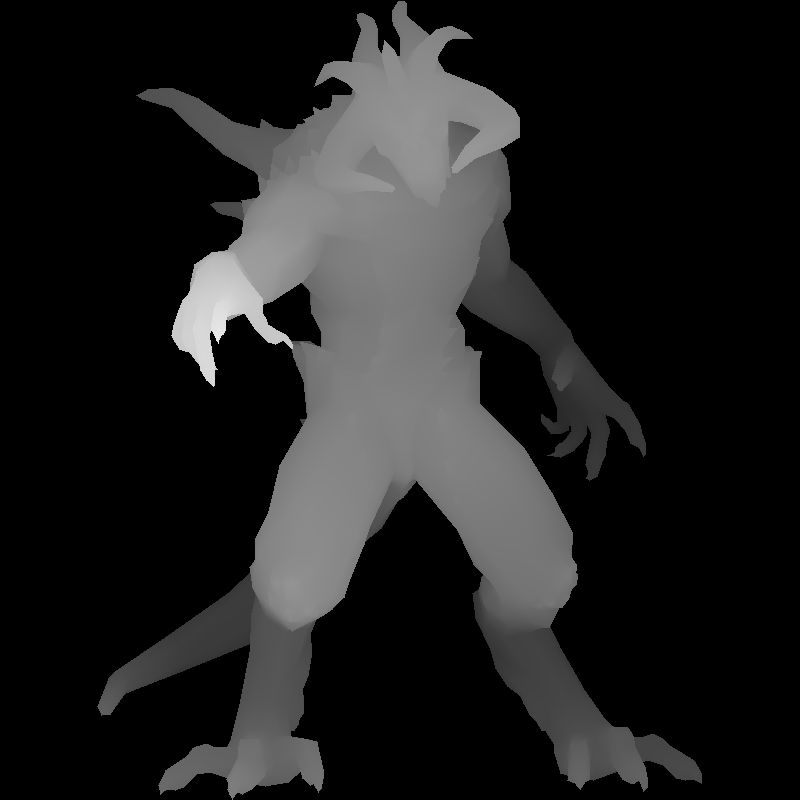
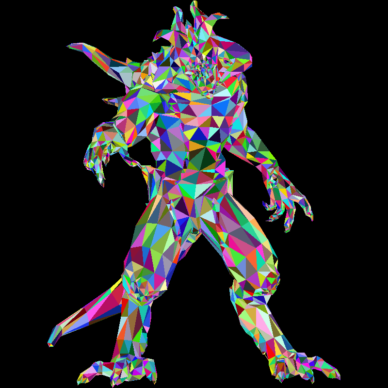

---
**Goals:**
- continue with tinyrenderer
- learn about back-face culling
- learn to use z-buffer algorithm
---

## Rasterization with Back-Face Culling

We will use the `z-buffer` algorithm (Painter's algorithm) to draw our image. 

```rust
fn triangle(
    img: &mut RgbImage,
    z_buffer: &mut GrayImage,
    a: Vertex3,
    b: Vertex3,
    c: Vertex3,
    color: Rgb<u8>,
) {
    let [za, zb, zc] = [a, b, c].map(|v| v.2); // z-coords

    let [a, b, c] = [a, b, c].map(|v| (v.0 as u32, v.1 as u32));

    let (bbmin, bbmax) = find_bbox(a, b, c);

    let area_abc = signed_area(a, b, c);

    // switch to non-parallelized version for simplicity
    for x in bbmin.0..bbmax.0 {
        for y in bbmin.1..bbmax.1 {
            let p = (x, y);

            let alpha = signed_area(p, b, c) / area_abc;
            let beta = signed_area(a, p, c) / area_abc;
            let gamma = signed_area(a, b, p) / area_abc;

            let z = (alpha * za + beta * zb + gamma * zc).round() as u8;
            if alpha >= 0.0 && gamma >= 0.0 && beta >= 0.0 && z >= z_buffer[(x, y)].0[0] {
                img[(x, y)] = color;
                z_buffer[(x, y)] = Luma([z]);
            }
        }
    }
}

fn project_transform_scale(v: &Vertex3) -> Vertex3 {
    // orthogonal projection
    // front view (looking down z-axis)
    // [-1, 1] -> [0, 2]
    let v = (v.0 + 1.0, v.1 + 1.0, v.2 + 1.0);

    // [0, 2] -> [0, W], [0, 2] -> [0, H]
    let v = (
        v.0 * (WIDTH - 1) as f32 / 2.0,
        v.1 * (HEIGHT - 1) as f32 / 2.0,
        v.2 * (255.0) / 2.0,
    );

    (v.0.round(), v.1.round(), v.2.round())
}

fn draw_wavefront(img: &mut RgbImage, z_buffer: &mut GrayImage, wavefront: &Wavefront) {
    let vertices = wavefront.vertices();

    for ft in wavefront.triangles() {
        let a = project_transform_scale(&vertices[ft.0 - 1]);
        let b = project_transform_scale(&vertices[ft.1 - 1]);
        let c = project_transform_scale(&vertices[ft.2 - 1]);

        let color: Rgb<u8> = Rgb(rand::random());

        triangle(img, z_buffer, a, b, c, color);
    }
}

fn main() -> anyhow::Result<()> {
    let path: PathBuf = std::env::args()
        .nth(1)
        .ok_or_else(|| anyhow::anyhow!("Usage: tinyrenderer <path_to_obj_file>"))?
        .into();

    let wavefront = Wavefront::read_from_file(&path)?;

    let mut img = RgbImage::new(WIDTH, HEIGHT);
    let mut z_buffer = GrayImage::new(WIDTH, HEIGHT);

    draw_wavefront(&mut img, &mut z_buffer, &wavefront);

    // because the tutorial uses a different coordinate system than ours
    flip_vertical_in_place(&mut img);
    img.save("out.png")?;

    flip_vertical_in_place(&mut z_buffer);
    z_buffer.save("zbuffer.png")?;

    Ok(())
}
```

**Question: How is the Z Value representing the Depth of pixel at (x, y)?**

Let's say we have: 
```
A(xa, ya, za)
B(xb, yb, zc)
C(xc, yc, zc)
```

The three vertices of our triangle. 

We know we can interpolate positions of the pixels inside the triangle using barycentric coordinates:

```
P = αA+βB+γC
```

But this formula works for not just position, but also depth, color, etc. 

```
F(P) = αF(A) + βF(B) + γF(C)
```

We can simply replace:

```
z = α(za)+β(zb)+γ(zc)
```

For a pixel at position P, `z` is it's depth. 

Rest is pretty simple, we only draw pixels in the triangle if they are closer to the camera than the previously drawn pixel. 

Our resulting models look much better now:




