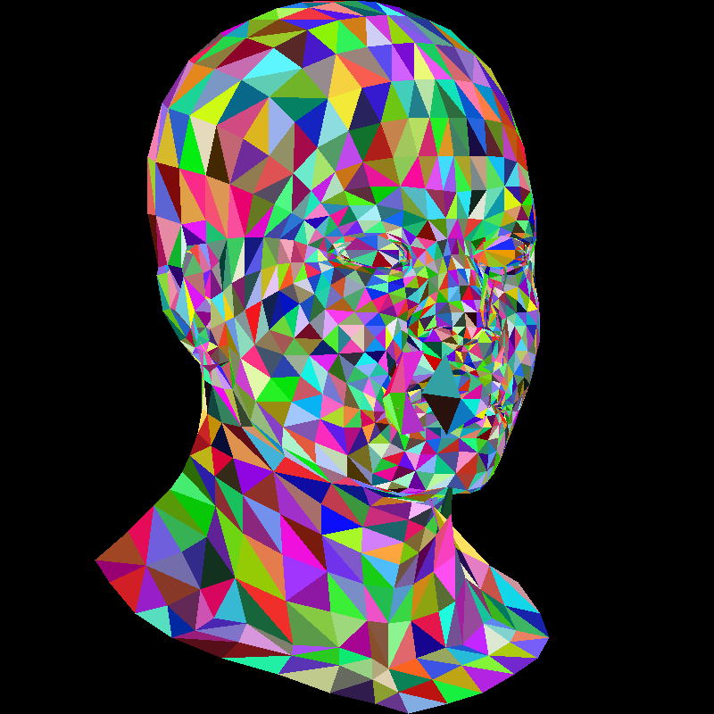
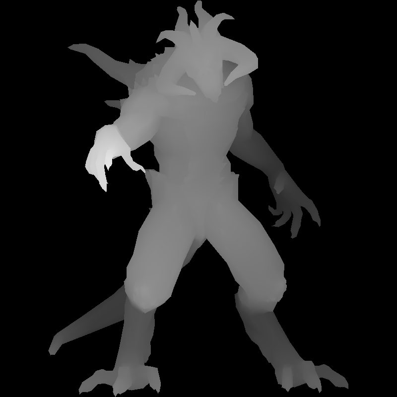
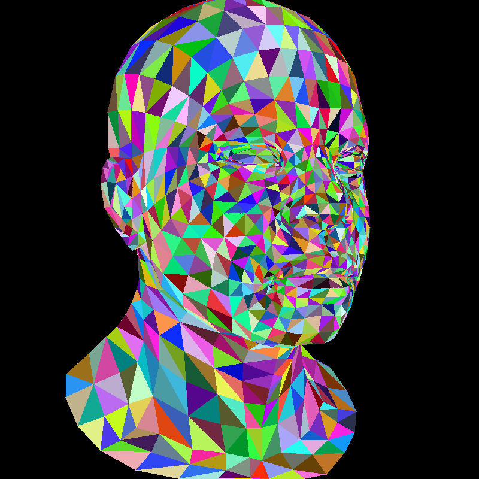

---
**Goals:**
- continue with tinyrenderer
- revisit matrices
- rotation and projection
- rendering pipelines
---

For this chapter, I've refactored the code to use primitives from the `nalgebra` crate. See this commit [c8cf09e](https://github.com/hedonhermdev/mythr/commit/c8cf09eea05e7447d0d5adc3a2e630553645195e) 

First we'll try a basic rotation using a rotation matrix. 

As an example, let's rotate the figure by 30 degrees along the y axis. 

```rust
fn rot(v: &Vertex) -> Vertex {
    let angle = PI / 6.0;

    #[rustfmt::skip]
    let mat = Matrix3::new(
        f32::cos(angle), 0.0, f32::sin(angle),
        0.0, 1.0, 0.0,
        -f32::sin(angle), 0.0, f32::cos(angle),
    );

    mat * v
}
```

```rust
fn draw_wavefront(img: &mut RgbImage, wavefront: &Wavefront) {
    for [a, b, c] in wavefront.triangles() {
        let color: Rgb<u8> = Rgb(rand::random());
        let a = project_transform_scale(&rot(a));
        let b = project_transform_scale(&rot(b));
        let c = project_transform_scale(&rot(c));

        triangle(img, a, b, c, color);
    }
}
```

We get a rotated render of the model. 

|  |  |
| ------------------- | ------------------- |

## Projection

Instead of using an orthographic projection, we can use a central projection. This has one major advantage: closer objects appear larger than distant ones. For a camera located at `(0 0 3)`

```rust
fn persp(v: &Vertex) -> Vertex {
    let c = 3.0;

    v / (1.0 - (v.z / c))
}
```




This gives a much more realistic view to our renders. 


## Rendering Pipelines

```rust
project(&persp(&rot(v)))
```

Right now, we apply 3 transformations to our 3D model to simulate a camera. This is common practice in rendering pipelines. Usually there are 5 coordinate systems connected by 4 transformations:

```
Viewport(Perspective(View(Model(v))))
```

Our goal is to unify these transformations by composing them. Instead of applying 3 different transformations, we'll apply a single final transformation to each vertex for faster batch processing of the geometry. 

## Linear Transformations

First, we'll learn about some linear transformations. A linear 

> A **linear transformation** is a function between vectors that **preserves the basic structure of vector space**.

Formally, a transformation TTT is linear if it satisfies **two rules** for all vectors u,vu, vu,v and scalars ccc:

**Additivity**
```
T(u+v)=T(u)+T(v)T(u + v) = T(u) + T(v)T(u+v)=T(u)+T(v)
```

If you add two vectors first and then transform, you get the same result as transforming each and adding them.

**Homogeneity**

```
T(cu)=cT(u)T(cu) = cT(u)T(cu)=cT(u)
```
Scaling a vector before or after the transformation gives the same result.


Common linear transformations:

1. Identity:
$$\begin{bmatrix}1&0\\0&1\end{bmatrix}
\begin{bmatrix}x\\y\end{bmatrix} = \begin{bmatrix}x\\y\end{bmatrix}$$
2. Scaling:
$$\begin{bmatrix} 2 & 0 \\ 0 & 1/2 \end{bmatrix}\begin{bmatrix}x\\y\end{bmatrix} = \begin{bmatrix} 2x\\(1/2)y\end{bmatrix}$$
3. Rotation:
$$\begin{bmatrix} \cos\theta & -\sin\theta \\  \sin\theta & \cos\theta  \end{bmatrix}$$
4. Shear:
$$\begin{bmatrix} 1 & 1 \\ 0 & 1 \end{bmatrix}$$
Since these are all square matrices, we can chain them. ie composability that we were looking for. 

## Affine Transformations
  
Formally, an affine transformation $T$  has form $T(\vec x)=A\vec x+\vec b$, where $\vec x$  is a vector (or a point),$A$  is a $n\times n$ matrix representing a linear transformation (like rotation, scaling or shear), and $\vec b$ is a translation vector.

In 2D:
$$\begin{bmatrix}x\\y\end{bmatrix} \quad \mapsto \quad \begin{bmatrix}a&b\\c&d\end{bmatrix}\begin{bmatrix}x\\y\end{bmatrix} + \begin{bmatrix}e\\f\end{bmatrix} = \begin{bmatrix}ax+by+e\\cx+dy+f\end{bmatrix}$$
Using homogenous coordinates:
$$\begin{bmatrix}
T(\vec{x}) \\
1
\end{bmatrix}
=
\begin{bmatrix}
A & \vec{b} \\
\vec{0}^\top & 1
\end{bmatrix}
\begin{bmatrix}
\vec{x} \\
1
\end{bmatrix}$$
$$\begin{bmatrix}a&b&e\\c&d&f\\0&0&1\end{bmatrix}\begin{bmatrix}x\\y\\1\end{bmatrix} = \begin{bmatrix}ax+by+e\\cx+dy+f\\1\end{bmatrix}$$
There is a lot of matrix math here that I couldn't be bothered to copy to markdown. See [here](https://haqr.eu/tinyrenderer/camera/) for reference. 

So for our 3D space, we'll be using `4x4` matrices to compute: Viewport, Perspective and ModelView. 

### Viewport

We define our viewport as a a window described by its top left corner `(x, y)` and it's width and height `(w, h)`. We can use the following 4x4 matrix for this viewport. 

```rust
fn viewport(x: u32, y: u32, w: u32, h: u32) -> Matrix4<f32> {
    let x = x as f32;
    let y = y as f32;
    let w = w as f32;
    let h = h as f32;

    #[rustfmt::skip]
    let viewport = Matrix4::new(
        w/2., 0., 0., x + w/2.,
        0., h/2., 0., y + h/2.,
        0., 0., 1., 0.,
        0.,0., 0., 1.
    );

    viewport
}
```
### Perspective

```rust
fn perspective(f: f32) -> Matrix4<f32> {
    #[rustfmt::skip]
    let perspective = Matrix4::new(
        1., 0., 0., 0.,
        0., 1., 0., 0.,
        0., 0., 0., 1.,
        0., 0., -1./f, 1.
    );

    perspective
}
```

